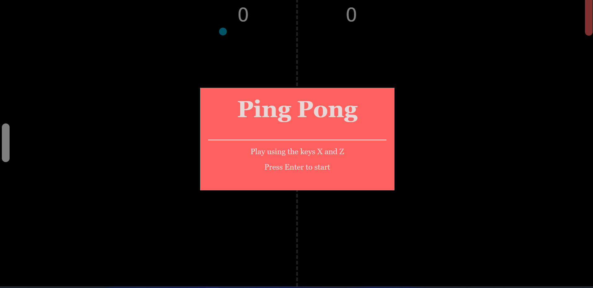

# JavaScript Ping Pong

## Description
JavaScript Ping Pong is a simple web-based game built using HTML, CSS, and JavaScript. The objective of the game is to bounce a ball back and forth between two paddles while trying to score points against your opponent. The game is based on the classic Pong game from the 1970s, but with a modern twist.

  

## Demo
You can play the game live here: 
<a href="https://aaeb-pingpong.netlify.app/">JavaScript Ping Pong</a>

## Usage
To play JavaScript Ping Pong, simply follow these steps:

1. Visit the live page link above.
2. Move your paddle up and down to bounce the ball back and forth.
3. Try to score points by getting the ball past your opponent's paddle.
4. Have fun!

## Issues
This game is still a work in progress and may have some issues. If you encounter any bugs or problems while playing, please feel free to report them by creating an issue in the GitHub repository.

## Contributing
If you'd like to contribute to the development of JavaScript Ping Pong, we welcome your contributions! You can contribute by submitting a pull request with your changes.

Here are some areas where you can help:

- Bug fixes and issue resolution
- Adding new features and functionality
- Improving game performance and optimization

Thank you for your interest in contributing to JavaScript Ping Pong!

## License
This project is licensed under the MIT License. See the [LICENSE](LICENSE) file for details.
